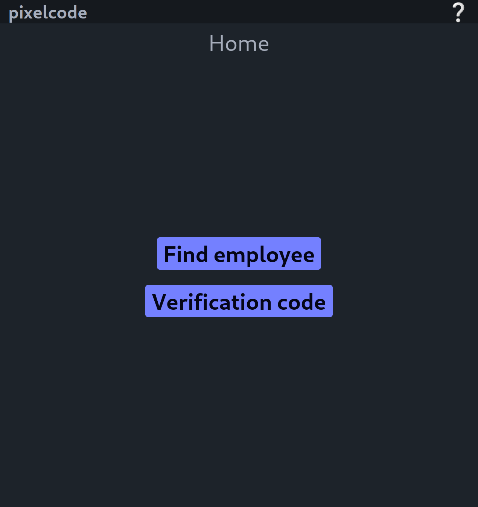
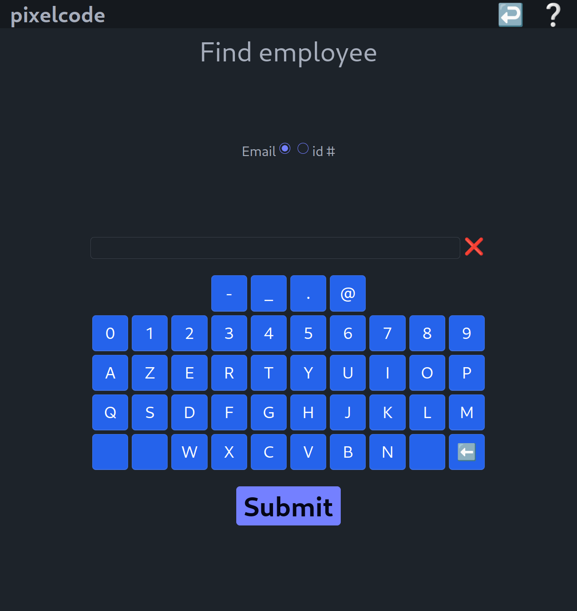
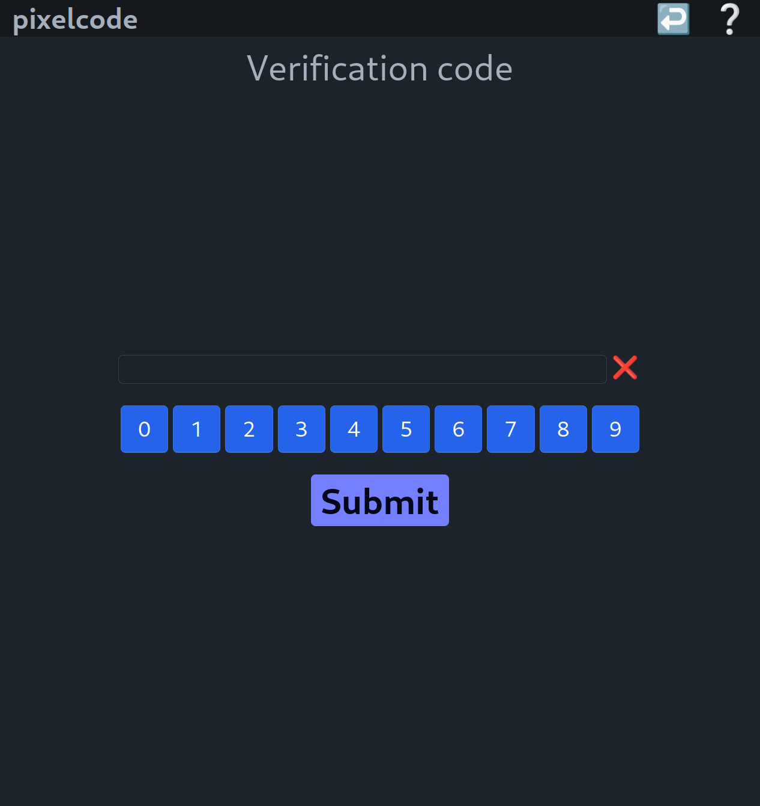
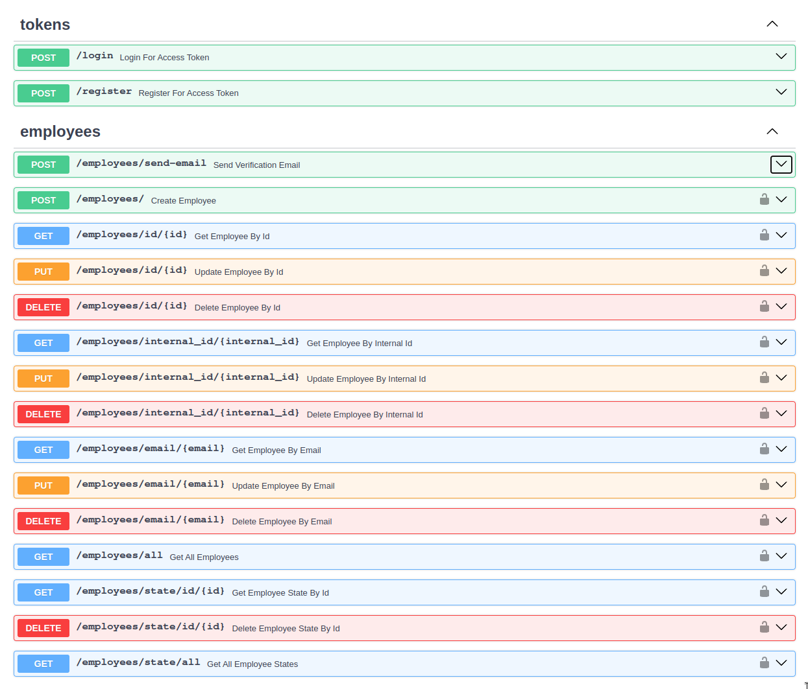
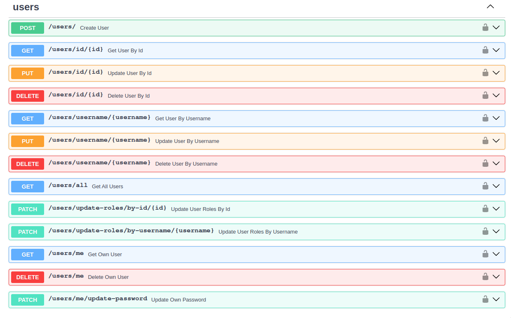

# pixelcode

Kiosk application to print QR codes to authenticated users.

The user first has to input their employee identifier (email or internal ID) so as to verify their identity. If the identifier is known, a verification code is sent to their email address.
Upon verification of the email address a unique QRCode is printed to them.

On server startup a default administrator user is created with a default password and the OAuth scope "admin".
Users with the admin role can create new users and grant them finely grained roles which have already been defined.

</img> </img> </img> </img> </img>

## Installing

If you only plan on running the Docker containers you can directly jump to [Running using Docker](#using-docker) after
having [set up your environment variables](#environment).

### User interface

The user interface can be installed using `npm`. Inside the `front` directory run:
```commandline
npm install
```

### Application server

Dependencies are defined in `pyproject.toml` and `requirements.txt`.
The application server can be installed in a virtual environment. For example using Poetry and in the project root:
```commandline
poetry install
```

## Running

### Environment

In `.env.example` :
- `SMPT_*` variables define settings for the emails service. Failing to update these values will not allow you to send emails.
- `ALGORITHM` and `SECRET_KEY` keys are used to sign JWT tokens.
- Change the value of `SECRET_KEY` to a randomly generated key using for example:
```commandline
openssl rand -hex 32
```
- `ORIGINS` and `VITE_API_URL` keys define respectively the URLs where the user interface and the API are accessible.

### Using Docker

Attention, update `.env.example` with your environment variables. Do not change the file name.
Both frontend and backend are dockerized. To start them, run in the project directory:
```commandline
docker compose up -d [--build]
```
or
```commandline
docker compose run -d [--build] <frontend | backend>
```
The application is served to `localhost:5173` by default.
The API documentation is available at `localhost:8000/docs` by default.

### From source

Attention, copy `.env.example` to `.env` with your environment variables.

#### User interface

Start the vite development server using:
```commandline
npm run dev
```
The application is served to `localhost:5173` by default.

#### Application server

Activate the virtual environment where the server is installed. For example using Poetry and in the project root:
```commandline
poetry shell
```
Then run:
```commandline
uvicorn app.main:api --reload
```
The API documentation is available at `localhost:8000/docs` by default.

## Details

`Typescript`, `Vite`, `VueJS` frontend, served through `NGINX`. NGIX server running as frontend `Docker` service.
`Python`, `FastAPI` backend, served through `uvicorn`. Uvicorn server running as backend Docker service.

## To do

- Backend: Printing using cups
- Backend: Cleanup qr codes once they are printed, enhance the security of csv route
- Backend: Enhance OpenAPI documentation
- Frontend: Finish Admin dashboard
- More efficient use of environment variables on the backend
